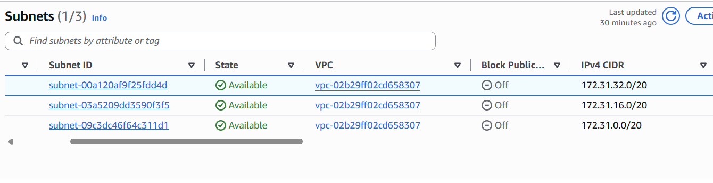
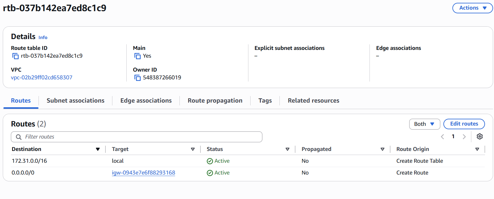
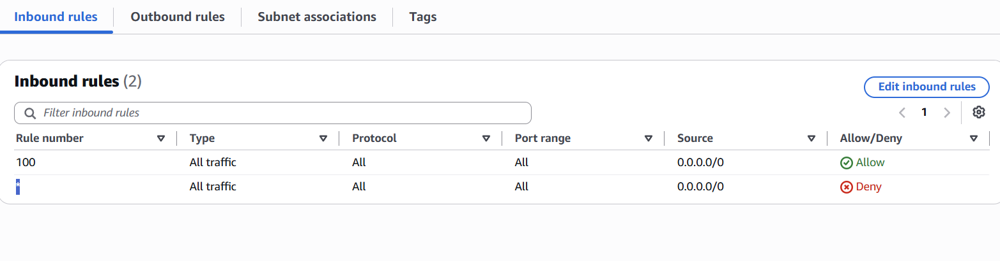
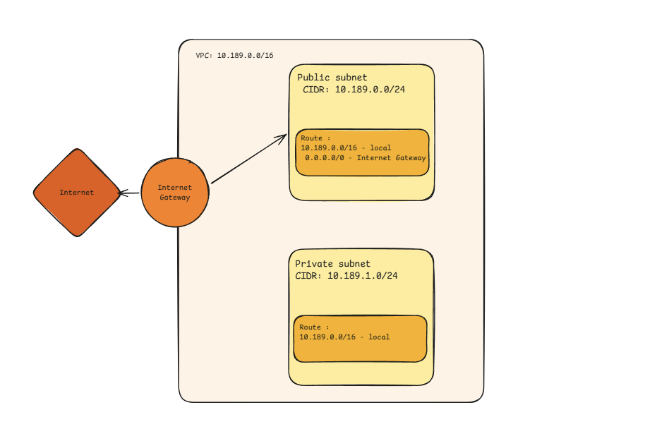

# Assignment 2 Submission

## About me

- GitHub username: gracefeliciano
- Section: IV-CCSAD
- IAM user name that I signed in with: ccsad-g05
- X: 189

---

## Part A. Explore

### A1. The VPC

Default VPC IPv4 CIDR:

172.31.0.0/16

Number of addresses in that CIDR:

65,536

### A2. The subnets

| Availability Zone | IPv4 CIDR |
| --- | --- |
| ap-southeast-1a | 172.31.32.0/20 |
| ap-southeast-1b | 172.31.16.0/20 |
| ap-southeast-1c | 172.31.0.0/20  |

Screenshot 1. Save it as `screenshot-1-subnets.png` in your folder. The image line below shows it.

### A3. Available addresses

Available IPv4 addresses in each subnet:

ap-southeast-1a 4,090, ap-southeast-1b 4,091, ap-southeast-1c 4,091.

Why is the number lower than 4,096?

A /20 provides 4,096 total addresses. AWS reserves 5 of these, if it is an empty subnet, normally, it would have 4,096 - 5 = 4,091 addresses.

What uses the missing address in the subnet with the lowest number?

ap-southeast-1a has 1 fewer address than the rest (4,091 - 1 = 4,090 addresses). The network interface holds one address, and the missing IP address is currently allocated to an instance.

### A4. The route table

| Destination | Target |
| --- | --- |
| 172.31.0.0/16 | local                 |
| 0.0.0.0/0     | igw-0943e7e6f88293168 |

Screenshot 2. Save it as `screenshot-2-routes.png` in your folder. The image line below shows it.

### A5. Public or private

Are the default subnets public or private? Which route proves it?

the subnet is public. The route table has a default route (0.0.0.0/0) pointing to an Internet Gateway.

### A6. The internet gateway

State of the internet gateway:

Attached

What happens to the default subnets if the gateway is detached?

Since the default route is detached from the internet gateway, it means it loses its path to the internet. However the instances can still communicate through the local route.

### A7. NAT gateways

Number of NAT gateways:

0

Can a server in a new private subnet download updates? Why?

Not yet. A new private subnet only uses the route table with a local route, this means, the subnets can only communicate with resources covered by that local route. For updates, the default route must have a target on the NAT Gateway.
### A8. The network ACL

| Rule number | Source | Allow or Deny |
| --- | --- | --- |
| 100 | 0.0.0.0/0 | Allow |
|  *  | 0.0.0.0/0 |  Deny |

How is a network ACL different from a security group?

A network ACL is a firewall on a subnet which has both Allow and Deny rules while a security group is a firewall on resources which only has the Allow rule.

Screenshot 3. Save it as `screenshot-3-network-acl.png` in your folder. The image line below shows it.

### A9. The default security group

Inbound rule (type and source):

The type is all traffic and the source is sg-0c5b6d4081cf0a534, which is the default security group.

Which resources can send traffic to an instance that uses it?

It allows resources only associated with the default security group. Traffic from anywhere else would be blocked since security groups have an implicit deny for traffic that does not match an inbound rule.
## Part B. Prepare

### B1. Plan two subnets

- Public subnet CIDR: 10.189.0.0/24
- Private subnet CIDR:10.189.1.0/24

### B2. Route tables

Route table of the public subnet:

| Destination | Target |
| --- | --- |
| 10.189.0.0/16  | local            |
| 0.0.0.0/0      | internet gateway |

Route table of the private subnet:

| Destination | Target |
| --- | --- |
| 10.189.0.0/16  | local            |

### B3. My VPC diagram

Tool used (Excalidraw, draw.io, Lucidchart, or paper):

Excalidraw

Save your diagram as `vpc-diagram.png` in your folder. The image line below shows it.

### B4. Predict a change

Can you still open the web page from your laptop? Why?

No, if the 0.0.0.0/0 was deleted, then the instance no longer has a route to the internet through the internet gateway. That's why the laptop cannot access the instance through the address.

Can the instance still reach another instance in the VPC? Why?

Yes, since it still has a connection to the local route despite not being connected to the internet. The local route allows for instances within the same VPC to connect with each other

### B5. Place a database

Which subnet gets the database? Why?

Private Subnet, the database should not directly be accessible to the public internet. 

### B6. My question about VPCs

What is your question, and what made you think of it?

Can one VPC have more than one Internet Gateway? We only used one Internet Gateway in this activity, so I wondered if a VPC could have multiple Internet Gateways.